### 😢 해당 포스트는 마이그레이션중인 포스트에요! 추후 업데이트 필요!
 

> 인터넷에서 Git issue에 대해 검색하면 나오는 사진. issue를 잘 사용하는 모습이다. 

저번 포스트에서는 Git과 Github의 차이를 알아보았다.     

이번 포스트에서는 우리는 잘 사용하지 않지만, 회사같은 프로젝트 중심의 그룹에서는 자주 사용하는 Git issue에 대한 내용을 다루겠다.

물론 학교나 혼자하는 소규모 단계의 프로젝트에서는 잘 사용하지 않지만, 조금만 프로젝트의 규모가 커진다면 사용하는 편이 오히려 편한 편이다. 개발의 흐름도 볼 수 있고. 

------

# 1. Git issue가 뭔데?

issue가 무엇일까? 사실 우리가 다루는 모든 것들이 issue이다. 디버깅, 특정 기능의 개발, 풀 리퀘스트, 도큐먼트 쓰기 등등 모든 것들이 issue이다.    

그렇다면 우리가 왜 issue라는 것을 알아야할까? Issue가 필요한 예시를 하나 들어보자.  

> 쇼핑몰 웹사이트 외주를 받아서 개발하는 도중에, fun_A기능이 필요해서 branch에 fun_A를 만들어서 작업하려고 했다. 그런데 같이 협업하는 B라는 사람이 먼저 fA라는 branch을 만들어서 동일한 기능을 개발하고 있는걸 나중에야 알아버렸다..     
> 다음에는 branch를 잘 봐야지 라는 생각을 가지고 다음 작업으로 fun_B기능이 필요해서 branch에 fun_B를 만드려했더니, 어라 C라는 사람이 또 먼저 하고 있었네? 아니 일을 하고있으면 하고있다고 말해야하는거 아니야..?? 

이렇게 여러 사람이 하나의 결과물을 가지고 공동으로 코딩하고 있는 경우에 다음과 같은 상황이 빈번히 일어나곤 한다. 누가 어떤 문제를 해결하고 있고, 누가 어떤 기능을 개발하고.. 여러 상황이 꼬여서 복잡한 모습이 될 것이다.    

물론 잦은 커뮤니케이션으로 이러한 문제를 해결할 수 있지만, 우리가 커뮤니케이션을 못하는 상황이 나올 수 있기도 하고 커뮤니케이션을 까먹기도 하니 근본적인 해결방법은 아니라고 생각한다.   

이럴 때 사용하는 것이 issue이다. 내가 어떠한 상황, 문제, 또는 플랜에 대해서 개발을 할 예정이라는 것을 알려주는 **이정표**인 것이다.    

우리는 이런 issue를 잘 발급하여, 그에 맞는 branch를 만들어서 그 issue를 해결하고 다시 merge시키는 일련의 작업들을 개발 단계에서 행한다.     

------

# 2. Git issue의 사용법은?

### A. Git issue 탭 들어가기

Github(또는 Gitlab)의 issue탭은 우선 우리가 생성한 repository를 들어가는 것에서 시작한다. 해당 repo를 들어가면 위의 탭 부분에서 issue 탭을 볼 수 있고, 그 탭을 누르면,  

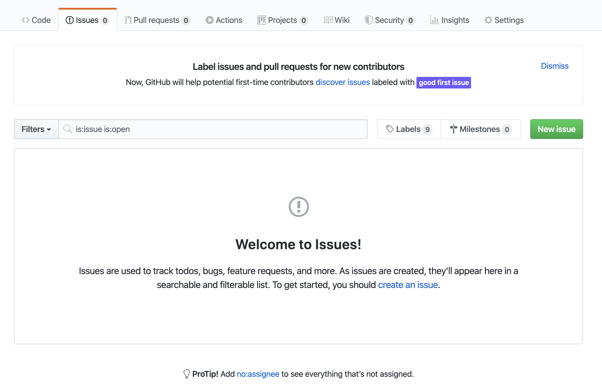

다음과 같은 화면이 보일 것이다.

처음 Github의 issue탭에 들어가면 다음과 같은 백지상태가 보일것이다. 이제 이 백지상태의 화면에 issue를 생성해보자.   

위 이미지에서 볼 수 있는, 초록색 **New issue** 버튼을 눌러보자. 

### B. Git issue 발행하기

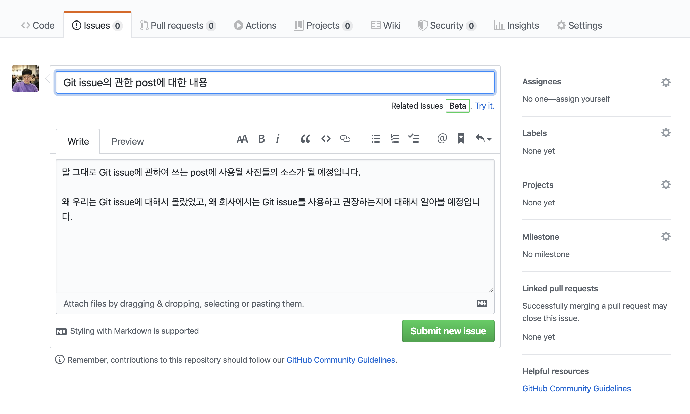

New issue 버튼을 누르면 위와 같은 화면으로 넘어간다. 이 화면에서 우리는 issue에 대한 상세정보를 작성해야한다.   

이미지에서 볼 수 있듯이, "Git issue에 관한 post에 대한 내용"이 적혀있는 부분이 issue의 제목부분이다.    

아래에 크게 글을 쓸 수 있게 되어있는, "말 그대로~~" 글자가 적혀있는 곳은 issue에 대한 상세정보를 적는 부분이다.     

이렇게 issue를 생성하면 다음과 같이 생성된다!

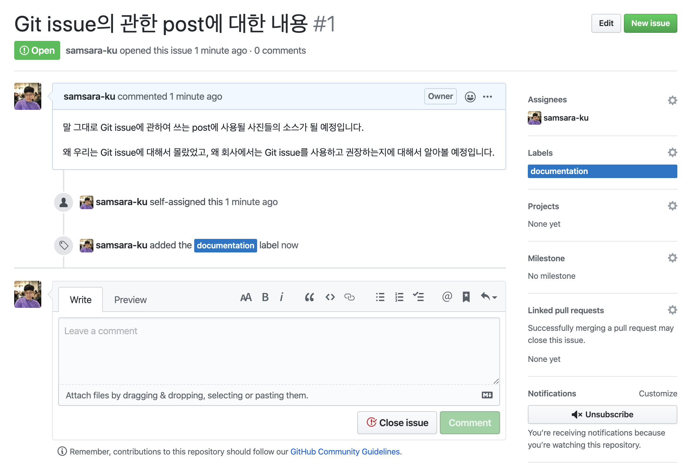

하지만 이렇게 생성된 issue를 관리하는건 매우 힘들다. 아무리 제목을 잘 지어둔다고 한들, 수많은 issue들 사이에서 내가 원하는 성격의 issue를 찾기란 정말 어려울것이다. 그때 사용하는 특성이 label이다. 

* label: 이 issue의 성격이 무엇인지에 대해서 설명해준다. 기본적인 Github의 labels들을 customize하여 쓸 수 있다.     

이러한 label을 사용하면 filtering이 쉬워지고, 한 눈에 issue가 어디에 속해있는지 알 수 있게된다. 

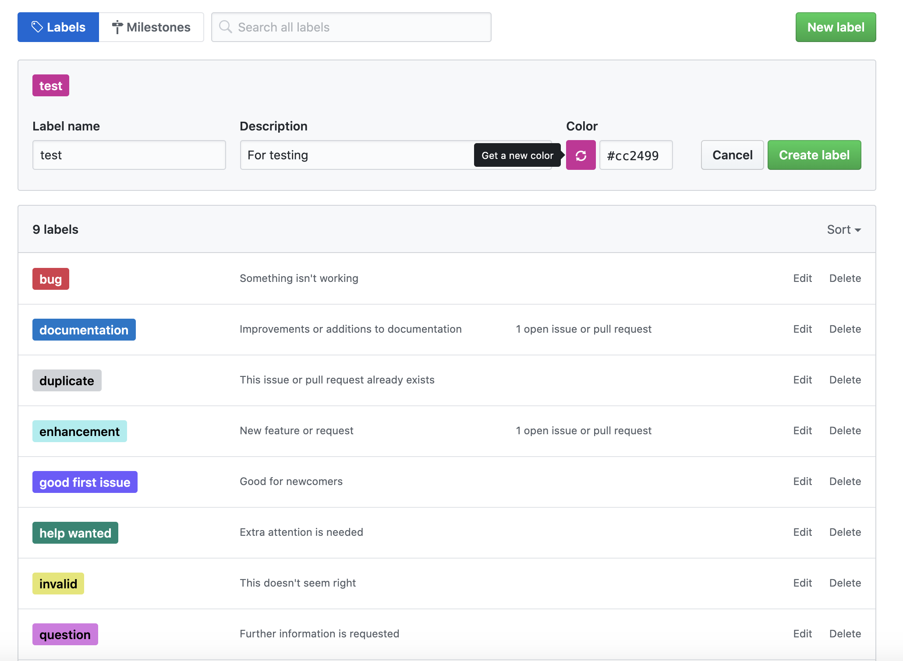

위의 이미지는 label의 설정 화면이다. Github에서 기본적으로 제공해주는 label들이 있으며, 위 이미지의 **test**처럼 내가 직접 label을 만들어서 관리할 수 있다.     

그렇다면 해당 issue의 성격까지는 알았는데 누가 이 issue에 관련되어있는지는 어떻게 알 수 있을까? 해당 문제는 **Assignees**라는 특성으로 해결할 수 있다.   

* Assignees: 이 issue에 누가 관련되어 있는지에 대해서 설명해준다. 내 자신을 관련시킬수도, 타인을 관련시킬수도 있다.  

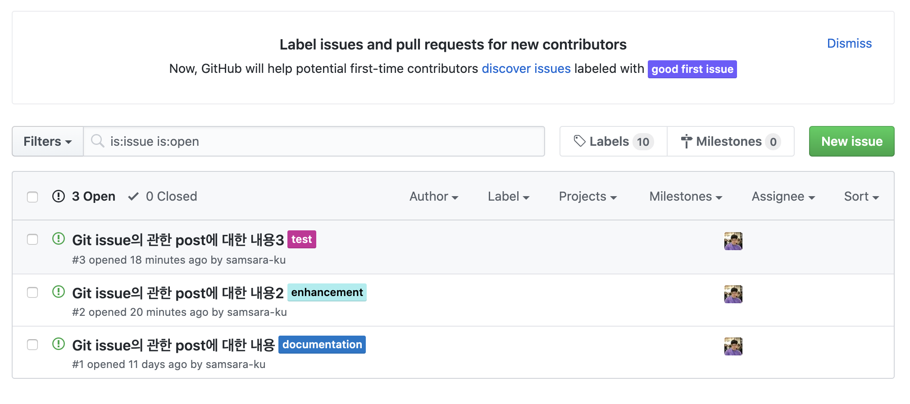

위 화면은 Assignee와 label을 모두 적용한 issue의 메인화면이다. 보다시피 색깔로 highlight되어있는 label들과, 각 issue들이 누구에게 할당되어있는지에 대한 assignee때문에 한결 보기 편해졌다!  

하지만 이렇게 잘 정리해도, 비슷한 기능들을 구현하는 issue들이 존재할 수 있다! 또한 이 issue들을 찾기 위해서는, 해당 issue들의 label로는 찾을 수 없다하면 어떻게 해야할까?   

이럴 때, 사용되는 특성이 바로 **Milestone**이다.    

* Milestone: 이 issue가 어디의 group에 속해있는지 설명해준다. Repository의 진행 상황을 표현할 때 사용한다.  

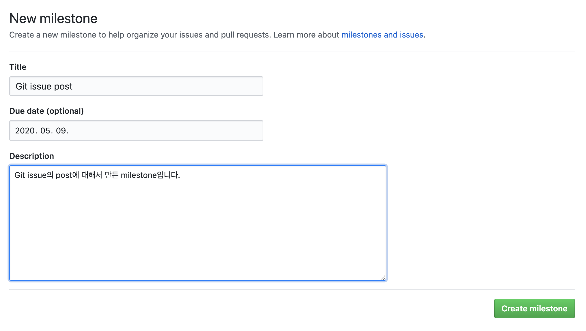

Milestone 탭을 눌러서 생성해보자. Milestone에는 제목, 기간, 설명들을 적을 수 있다. Issue들이 개발할 때 사소한 문제점들을 적어놓는 곳이라면, milestone은 그것보다 좀 더 큰 그림을 그릴 때 사용한다.  

Milestone에는 아래와 같이 issue들을 관련시킬 수 있고, 그 관련되어있는 issue들의 진행 상황(open/close)에 따라 milestone의 진행상황이 달라진다.

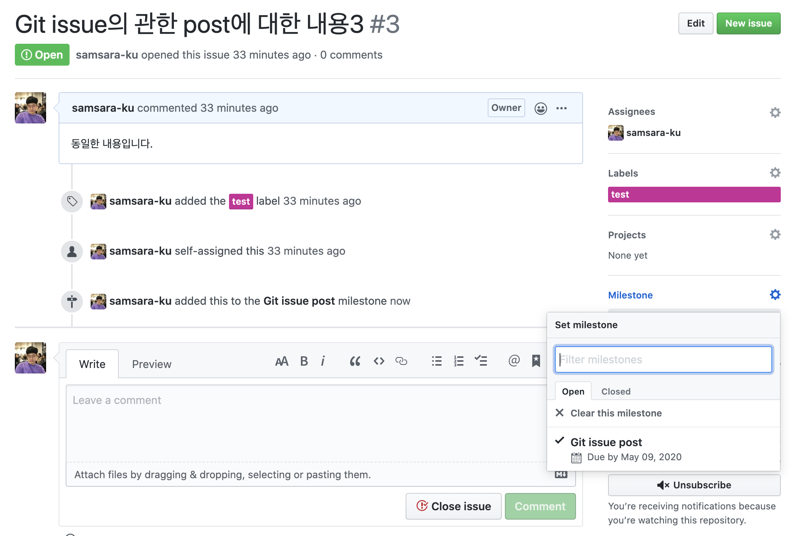

만약 issue를 3개 관련시키고 그 중 하나를 close시키면 다음과 같이 milestone의 진행상황이 변한다.  

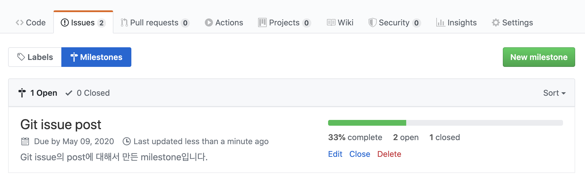

그런데 이렇게 milestone, label, assignee를 사용하면 issue 각각의 상황은 알아볼 수 있어도, 개발의 전반적인 진행상황이 눈에 보이지 않을때가 있다.     

Project의 workflow를 보고 싶다면 어떻게 해야할까? **Project**탭을 사용하면 된다. 일단 Project탭에 들어가자. 그러면 다음과 같은 화면이 당신을 반길텐데,

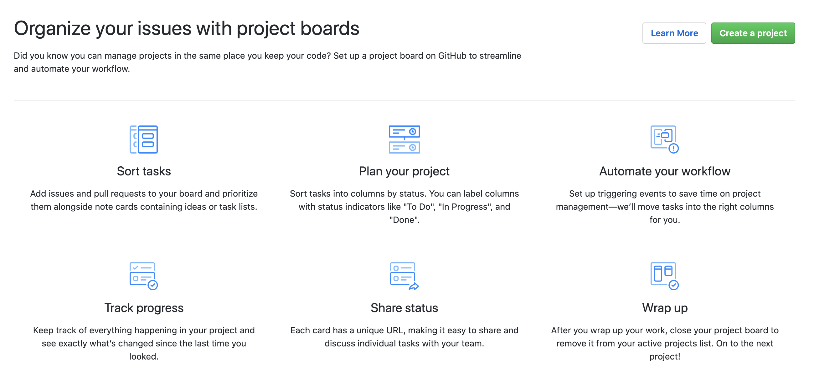

우리는 여기서 쿨하게 "Create Project" 버튼을 누르고,

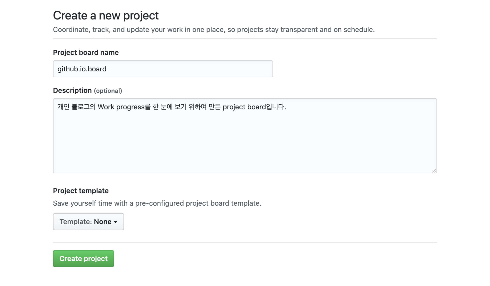

Project의 제목, 설명, 템플릿을 설정해준다. 템플릿같은 경우는 자주 사용하는 "Automated Kanban Board"를 사용해서 만들면 다음과 같은 화면이 나오는데,

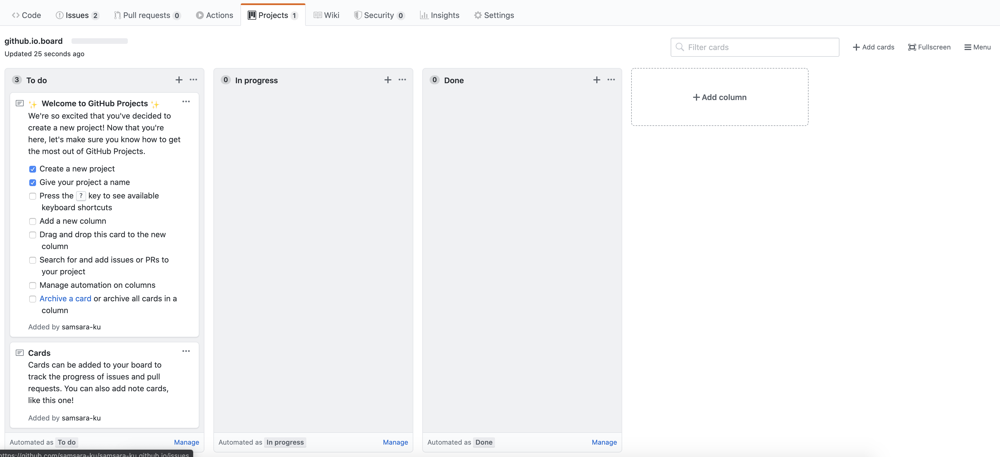

우리는 여기서 **Card**라는 issue와 비슷한 단위 개념을 만들 수 있다. 이 card들을 생성해서 우리는 issue와 비슷한 개념으로 해야 할 일, 하고 있는 일, 한 일을 표시할 수 있다.     

물론 이 card들을 이용해서 해당 issue를 생성할 수도 있다. **Trello**라는 프로그램을 사용해신 분들은 상당히 비슷하다는 것을 알 수 있을것이다.     

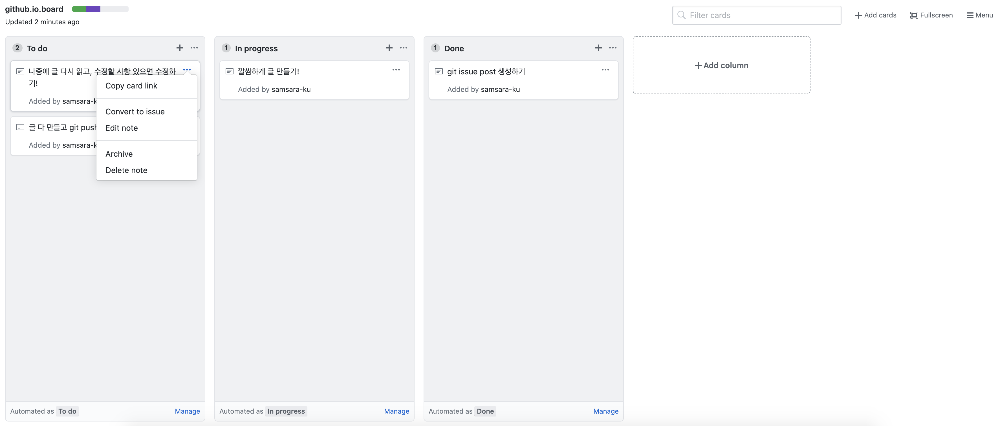

다음은 card들을 이용해서 간단하게 project를 꾸며보았다. 이러한 방식으로 Project탭을 이용하여 efficient한 working process를 만들 수 있다.

### C. Git issue 수정하기

이렇게 만든 issue들은 당연히 수정을 할 수 있는데, `@User` 키워드를 사용해서 같은 member를 태그하거나 `#Ref`를 이용하여 특정 issue를 참조하여 설명을 추가할 수 있다.     

부족한 설명들은, 팀원과의 협업에 저해가 되는 요소이니 꼭 충분한 설명으로 팀원들의 이해를 도와주자. :)
