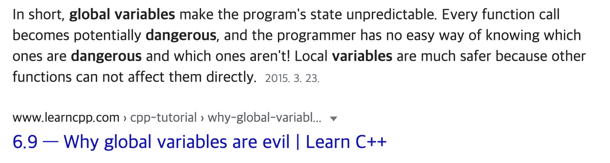

### 😢 해당 포스트는 마이그레이션중인 포스트에요! 추후 업데이트 필요!
<br />


약 한 달만의 포스트이다.   

지난 한 달동안 회사일에 집중도 하고, 서울에 올라온 기념으로 친구들도 많이 만나서 블로그 포스팅을 진행하지 못했다.. (~~사실 안한게 아닌가 싶은데~~)

다시 열심히 하려고 회사일에 집중하면서, 나에게 필요한 내용들을 찾아 보다가 [js의 꿀팁](http://javascriptissexy.com/12-simple-yet-powerful-javascript-tips/)같은 사이트를 찾게되었다.    

해당 내용을 읽어보면서 나같은 javascript beginner들이 처음보면 얼타버릴 수 있는(이게 뭐지 싶은), 그러한 팁들이 많이 존재했다! 1번부터 막혀서 깜짝놀랐다..    

중요한 점은, 해당 포스트를 읽으면서 IIFE라는 내용을 처음 접하게 되었는데 딱 봐도 축약어인게 뭐에 대한 축약어인지 잘 몰라서 검색해보니 다음과 같게 나왔다.    

>IIFE(Immediately Invoked Function Expressions: “Iffy”라고 발음)는 즉시 호출 함수 표현식의 줄임말입니다.    

정의만 보고도 내가 정리해야 할만한 내용임을 직감하게 되어서 해당 내용을 정리하려던 참에 이 포스트를 작성하게 되었다!    

그래서 오늘은 IIFE는 무엇인지, 언제 써야하는지에 대해서 알아보도록 하자. 

---

## 1. 함수 선언식 / 함수 표현식

위에서도 설명했었지만, IIFE(Immediately Invoked Function Expressions)는 **즉시 호출 함수 표현식의 줄임말**이라고 한다.    

나같은 js beginner들은 함수 표현식과 함수 선언식에 대해서 잘 모르거나, 대충은 알고 있지만 물어볼 때마다 헷갈릴 수 있으니 정리하면서 가보려고 한다.    

먼저, 함수 선언식이란 다음과 같은 함수의 형태를 의미한다.    

```
function sum(x, y) {
    return x + y
}
```
<br />
그렇다면 함수 표현식은 무엇일까? 함수 표현식은 다음과 같은 함수의 형태를 의미한다.    

```
var sum = function (x, y) {
    return x + y
}
```
<br />
느낌이 오는가? [MDN의 설명](https://developer.mozilla.org/en-US/docs/Web/JavaScript/Reference/Functions?redirectlocale=en-US&redirectslug=JavaScript%2FReference%2FFunctions_and_function_scope#Defining_functions)에서는 "**함수 표현식**은 **함수 선언식**과 동일한 문법을 가지고 무기명(anonymous)함수를 이용할 뿐이다"라고 정의하지만, 이는 사실 겉표면만 보고 이야기할 때 옳은 말이다.    

자세하게 내부로 들어가게 되면 [호이스팅(Hoisting)](https://developer.mozilla.org/ko/docs/Glossary/Hoisting)이라는 개념과 관련이 있지만, 해당 내용의 상세한 설명은 나중에 다루도록 하고 아래의 한 문장만 기억하도록 하자!    

**함수 선언(declaration)은 언제든지 호출할 수 있지만, 함수 표현(expression)은 아니다.**    

---

## 2. IIFE는 무엇인가요?

이제 그럼 본격적으로 IIFE에 대해서 알아보자.    

위에서도 말했지만, IIFE는 **Immediately Invoked Function Expressions**으로, 한국어로 직역하면 **즉시 호출 함수 표현식**을 의미한다.    

그럼 IIFE는 어떻게 만드는걸까? 다음의 예시를 확인해보자.    


```
function addTogether() {
    var x = 10
    var y = 20
    var answer = x + y
    console.log(answer)
}

addTogether()
```
<br />
일반적인 함수 선언식이여서 실망하셨을수도 있지만, 여기서부터 시작하면된다.    

우리가 여기서 **IIFE**를 만들기 위해서는 먼저 소괄호(brackets)으로 함수를 감싸는 것 부터 시작한다. 그렇게 된다면 위의 함수는,    

```
(function addTogether() {
    var x = 10
    var y = 20
    var answer = x + y
    console.log(answer)
})
```
<br />
위와 같은 내용이 될 것이다. 여기서 우리는 **IIFE**가 **함수 표현식**임을 다시 한 번 상기하면, 다음과 같이 바꿀 수 있을 것이다.    

```
(function() {
    var x = 10
    var y = 20
    var answer = x + y
    console.log(answer)
})
```
<br />

왜 이렇게 변하는지 모르겠는 분들은 글의 서두부터 천천히 읽으시면 왜 그런지 알게 될 것이다! 너무 쉬운 내용이니 패스하겠다.    

그리고 위의 내용이 이제 함수 표현식이 되었는데, 우리가 이 함수 표현식을 **즉시 호출** 시켜야 IIFE가 되는것이다! 그렇다면 우리가 위의 함수식을 어떻게 호출할 수 있을까? 다음과 같이 하면 된다.    

```
(function() {
    var x = 10
    var y = 20
    var answer = x + y
    console.log(answer)
})()
```
<br />

차이점이 보이는가? 바로 뒤에 또 소괄호(brackets)를 넣었다! 우리가 일반적으로 함수를 호출하기 위해서는 함수명을 쓴 뒤, 뒤에 소괄호를 붙히는게 일반적이다. 이렇게 IIFE가 완성되었다!    

---
## 3. 왜 IIFE를 사용하나요?



> Google에 global variable dangerous라고 치면 나오는 글. **EVIL**이라고 표현할 정도이다.

**전역 변수를 사용하지 않기 위해서**    

많은 프로그래머들이 전역 변수의 편리함에 대해서 인지하고 있지만, 그것의 side-effect도 동시에 인지하고 있을거다.    

많은 사람들도 되도록 안쓰는게 좋다고 생각하는 만큼, 그것이 우리에게 가져다 줄 편리함보다 그것이 우리에게 가져다 줄 위험성이 너무 크다.    

그렇기 때문에 많은 사람들은, 전역 변수를 사용하기를 꺼려하고 나 또한 그렇게 배워왔다.    

오늘 포스트에서 봤던 IIFE같은 경우는 전역변수의 사용을 최소화 하기 위해서 만들어진 함수 표현식이다. 좋은 기법이라고 생각하고 있고, 나중에 쓸 일이 있으면 적극적으로 사용해봐야겠다!    

더 자세한 내용들은 내가 참고했었던 블로그의 포스트를 참고하시면 좋을 것 같다. 이 내용은 단순히 그 내용들을 정리한 정도이니 :)

[What is an IIFE in JavaScript?](https://medium.com/javascript-in-plain-english/https-medium-com-javascript-in-plain-english-stop-feeling-iffy-about-using-an-iife-7b0292aba174)

[Javascript IIFE 이해하기](http://chanlee.github.io/2014/01/11/understand-javascript-iife/)